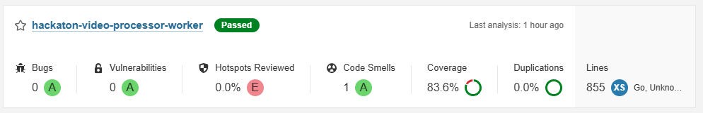
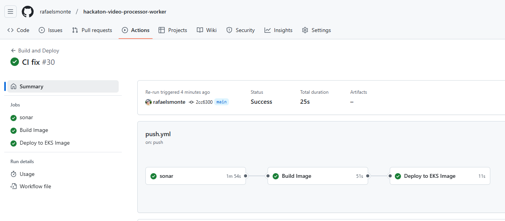
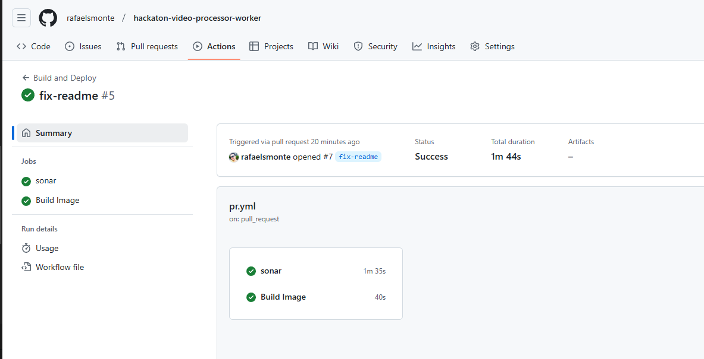

## Hackathon 7SOAT Video Processor Worker Service - FIAP

This project implements a video worker responsible for downloading a video, extracting frames as images (one per second), compressing them, and uploading them to Amazon S3.

The project follows **Clean Architecture** and is implemented using **Golang**.

This documentation is organized as follows:

- **Service**: Outlines the core business rules and workflows, detailing how the service integrates with other system components.
- **Development**: Provides step-by-step instructions for setting up the development environment and running the project locally.

### Documentation

- [Video Processor Worker Service](docs/service.md)
- [Development](docs/development.md)
- [CI/CD](docs/ci-cd.md)
### Authors

- _Rafael Santos Monte (RM355045)_
- _Thiago Thalison Firmino de Lima (RM354998)_
- _Vitor Manoel da Silveira (RM355029)_

### Coverage

## Evidences

