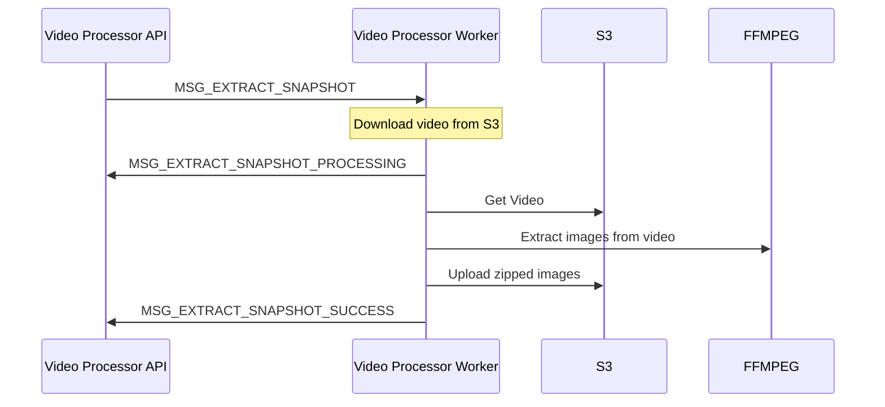
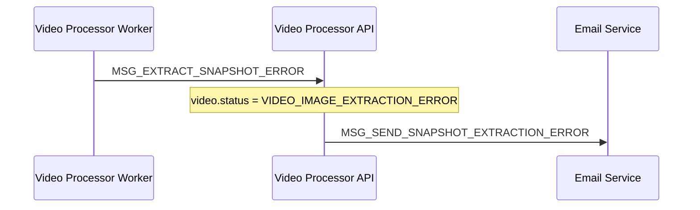

---

### Service Flows  
**Video Image Extraction Process**  



The Video Processor API sends a message to the Video Processor Worker through the messaging service with the structure:

```json
{
  "type": "MSG_EXTRACT_SNAPSHOT",
  "sender": "VIDEO_API_SERVICE",
  "target": "VIDEO_IMAGE_PROCESSOR_SERVICE",
  "payload": {
    "videoId": "string", // The video ID
    "userId": "string"   // The user ID, received in the request header
  }
}
```

**The Video Processor Worker:**

- Receives the image extraction message.  
- Downloads the video from AWS S3 using the `videoName` and `userId`  provided.  

**The Video Processor Worker:**

- Uses FFMPEG to extract images from the video at every single keyframe.  
- Generates a sequence of images from the video.  

**The Video Processor Worker:**

- Compresses the extracted images into a ZIP file.  
- Uploads the ZIP file back to AWS S3, generating a URL for the file.  

**The Video Processor Worker:**

- Sends a message to the Video Processor API indicating that the image extraction was completed successfully.  

```json
{
  "type": "MSG_EXTRACT_SNAPSHOT_SUCCESS",
  "sender": "VIDEO_IMAGE_PROCESSOR_SERVICE",
  "target": "VIDEO_API_SERVICE",
  "payload": {
    "videoId": "string", // The video ID
    "userId": "string",  // The user ID, representing the owner of the video
    "videoSnapshotsUrl": "string" // The URL for the zip file with the extracted images
  }
}
```


### Handling Errors in Image Extraction

If an error occurs during image extraction, the Video Processor Worker sends an error message.



**The Video Processor Worker** receives an error when attempting to extract the images.

The error may occur due to failures in downloading the video, processing with FFMPEG, or uploading to S3.

The Video Processor Worker sends an error message to the Video Processor API with the structure:

```json
{
  "type": "MSG_EXTRACT_SNAPSHOT_ERROR",
  "sender": "VIDEO_IMAGE_PROCESSOR_SERVICE",
  "target": "VIDEO_API_SERVICE",
  "payload": {
    "videoId": "string", // The video ID
    "userId": "string",  // The user ID, representing the owner of the video
    "errorMessage": "string",
    "errorDescription": "string"
  }
}
```

The Video Processor API:
- Updates the video status to `VIDEO_IMAGE_EXTRACTION_ERROR`.  
- Sends a message to the Email Service to notify the user about the error in extraction.  

### Important Considerations:
- **FFMPEG**: For image extraction, FFMPEG can be configured to extract images from specific frames or at defined intervals. You can set the number of images extracted or even their quality.  
- **Image Compression**: After extraction, the images should be compressed and sent to S3 in a `.zip` file. Ensure that the file is well-compressed to facilitate downloading by the user.  
- **Messaging**: Use a queue or a messaging system (such as Kafka, RabbitMQ, or AWS SQS) to ensure that communication between services is handled asynchronously and at scale.

